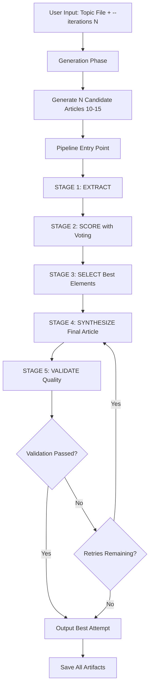

# Article Synthesis Pipeline Architecture Plan
## Extension of post_generator.py

---

## Executive Summary

This document outlines the architecture for extending [`post_generator.py`](../post_generator.py:1) to implement a 5-stage article synthesis pipeline: **EXTRACT → SCORE → SELECT → SYNTHESIZE → VALIDATE**. The enhancement transforms the script from a simple multi-iteration generator into a sophisticated quality-driven content synthesis system that generates 10-15 candidate articles and combines their best elements into a superior final article.

---

## Current State Analysis

### Existing [`post_generator.py`](../post_generator.py:1) Capabilities

1. **Environment Management**: Loads configuration from `.env` for local OpenAI-compliant API
2. **Prompt Building**: Combines reference context files (writing style, company context, market analysis)
3. **LLM Communication**: Robust [`send_to_llm()`](../post_generator.py:122) function with retry logic
4. **Multi-iteration Generation**: `--iterations` flag generates numbered articles (output-01.md, output-02.md, etc.)
5. **Basic Filtering**: Optional `<think>` tag removal
6. **File Operations**: Saves markdown files with word counts

### Key Existing Functions to Leverage

- [`load_environment()`](../post_generator.py:19): Environment setup
- [`build_system_prompt()`](../post_generator.py:52): Context aggregation
- [`send_to_llm()`](../post_generator.py:122): Core LLM communication with retry logic
- [`filter_think_tags()`](../post_generator.py:91): Text processing utility

---

## High-Level Architecture

### Pipeline Flow Diagram



### Integration Strategy

**Minimal Modification Approach**: Add pipeline stages as new functions after the existing generation loop completes. The workflow becomes:

1. **Phase 1: Generation** (existing code, lines 273-327)
   - Generate N candidate articles using existing iteration loop
   - Store candidates in memory list instead of just saving to disk

2. **Phase 2: Synthesis Pipeline** (new code)
   - Pass candidate articles through 5-stage pipeline
   - Generate and save synthesis artifacts
   - Output final synthesized article

---

## Data Structures and Schemas

### Core Data Models

```python
from dataclasses import dataclass, field
from typing import List, Dict, Optional

@dataclass
class ArticleCandidate:
    """Container for a generated article candidate."""
    article_id: int
    content: str
    word_count: int
    generation_timestamp: float

@dataclass
class ArticleCard:
    """Structured extraction from a candidate article (EXTRACT stage output)."""
    article_id: int
    headline_candidates: List[str]
    opening_hook: str
    core_argument: str
    key_points: List[str]
    memorable_phrases: List[str]
    structural_approach: str
    evidence_used: List[str]
    tone: str
    target_audience_signals: str
    weaknesses: List[str]
    word_count_estimate: int

@dataclass
class ArticleScore:
    """Quality scores for an article card (SCORE stage output)."""
    article_id: int
    scores: Dict[str, Dict[str, any]]  # criterion_name -> {score: int, justification: str}
    overall_score: float
    standout_strengths: List[str]
    critical_weaknesses: List[str]

@dataclass
class SynthesisBlueprint:
    """Specification for combining best elements (SELECT stage output)."""
    selected_headline: Dict[str, any]
    selected_opening: Dict[str, any]
    selected_structure: Dict[str, any]
    selected_arguments: Dict[str, any]
    selected_evidence: List[Dict[str, any]]
    phrases_to_preserve: List[Dict[str, any]]
    elements_to_avoid: List[str]
    synthesis_notes: str
    confidence: Dict[str, any]

@dataclass
class ValidationResult:
    """Quality assessment of synthesized article (VALIDATE stage output)."""
    passed: bool
    blueprint_compliance: Dict[str, any]
    quality_scores: Dict[str, int]
    coherence_assessment: Dict[str, bool]
    issues: List[str]
    improvement_suggestions: List[str]
    target_threshold: float
    threshold_met: bool
```

### JSON Schema Constants

```python
# Scoring criteria with weights (from implementation plan)
SCORING_CRITERIA = {
    "hook_strength": {
        "description": "How compelling is the opening? Does it create curiosity, tension, or immediate value?",
        "weight": 0.15
    },
    "argument_clarity": {
        "description": "Is the core message immediately clear? Can you summarize it in one sentence?",
        "weight": 0.20
    },
    "evidence_quality": {
        "description": "Are claims supported with specifics? Statistics, examples, case studies?",
        "weight": 0.15
    },
    "structural_coherence": {
        "description": "Does the structure serve the argument? Is there a logical flow?",
        "weight": 0.15
    },
    "originality": {
        "description": "Does it offer a fresh angle? Or is it generic advice anyone could write?",
        "weight": 0.15
    },
    "memorability": {
        "description": "Are there phrases or ideas that stick? Would someone quote this?",
        "weight": 0.10
    },
    "actionability": {
        "description": "Does the reader know what to do after reading? Is there a clear next step?",
        "weight": 0.10
    }
}
```

---

## Stage-by-Stage Implementation Plan

### STAGE 1: EXTRACT - Article Card Generation

**Purpose**: Convert each full article (~5000 words) into a compressed "Article Card" (~400-600 words) that captures essence in structured format.

**Implementation Details**:

```python
# ============================================================================
# PIPELINE STAGE 1: EXTRACT
# Purpose: Convert full articles into structured article cards
# ============================================================================

def extract_article_card(
    article_content: str,
    article_id: int,
    verbose: bool = False,
    retry_count: int = 3
) -> ArticleCard:
    """
    Extract structured card from a single article.
    
    Args:
        article_content: Full article text
        article_id: Unique identifier for this article
        verbose: Enable progress logging
        retry_count: Number of retry attempts for failed extractions
        
    Returns:
        ArticleCard with structured data
    """
    system_prompt = """You are a content analysis agent. Your job is to extract the essential elements from a marketing blog article into a structured format.

You must respond with ONLY a valid JSON object. No markdown, no explanation, no preamble.

## Output Schema

{
  "article_id": <integer>,
  "headline_candidates": [
    "<headline 1 from article>",
    "<headline 2 - alternative or subheading that could work as main>"
  ],
  "opening_hook": "<The first 2-3 sentences verbatim. This is the hook that draws readers in.>",
  "core_argument": "<A 2-3 sentence summary of the article's central thesis or value proposition. What is this article really saying?>",
  "key_points": [
    "<Key supporting point 1>",
    "<Key supporting point 2>",
    "<Key supporting point 3>",
    "<Key supporting point 4 if present>",
    "<Key supporting point 5 if present>"
  ],
  "memorable_phrases": [
    "<Verbatim quote of a particularly well-written phrase or sentence>",
    "<Another strong phrase worth preserving>",
    "<Up to 5 total>"
  ],
  "structural_approach": "<Brief description: How is this article organized? (e.g., 'Problem-Solution-CTA', 'Listicle with intro/outro', 'Story-driven with embedded lessons', 'Question-answer format')>",
  "evidence_used": [
    "<Type of evidence: statistic, case study, expert quote, analogy, etc.>"
  ],
  "tone": "<1-3 words describing the tone: e.g., 'conversational and urgent', 'professional and authoritative', 'playful and accessible'>",
  "target_audience_signals": "<Who does this article seem written for? What assumptions does it make about the reader?>",
  "weaknesses": [
    "<Identified weakness 1: e.g., 'Opening is generic', 'Lacks concrete examples', 'Too long before getting to the point'>",
    "<Identified weakness 2 if present>"
  ],
  "word_count_estimate": <integer>
}

## Rules
- Extract what IS there, don't invent or improve
- For "memorable_phrases", copy VERBATIM - these are candidates for preservation
- Be specific in weaknesses - vague criticism isn't useful
- If the article lacks something (e.g., no statistics), note it in weaknesses"""

    user_prompt = f"""Extract the article card for Article #{article_id}.

<article>
{article_content}
</article>

Respond with only the JSON object."""

    for attempt in range(retry_count):
        try:
            response = send_to_llm(
                user_prompt=user_prompt,
                system_prompt=system_prompt,
                temperature=0.3,  # Low temp for consistent extraction
                max_tokens=4000,
                verbose=verbose
            )
            
            # Parse and validate JSON
            card_data = json.loads(response)
            
            # Validate required fields
            required_fields = [
                "article_id", "headline_candidates", "opening_hook",
                "core_argument", "key_points", "memorable_phrases",
                "structural_approach", "evidence_used", "tone",
                "target_audience_signals", "weaknesses"
            ]
            
            for field in required_fields:
                if field not in card_data:
                    raise ValueError(f"Missing required field: {field}")
            
            # Create ArticleCard object
            card = ArticleCard(**card_data)
            
            if verbose:
                print(f"  ✓ Extracted card for Article #{article_id}")
            
            return card
            
        except (json.JSONDecodeError, ValueError) as e:
            if verbose:
                print(f"  ⚠ Extraction attempt {attempt + 1} failed: {e}")
            if attempt == retry_count - 1:
                raise RuntimeError(f"Failed to extract valid card after {retry_count} attempts")
    
    raise RuntimeError("Extraction failed unexpectedly")


def extract_all_article_cards(
    candidates: List[ArticleCandidate],
    verbose: bool = False
) -> List[ArticleCard]:
    """
    Extract article cards from all candidates.
    
    Args:
        candidates: List of generated article candidates
        verbose: Enable progress logging
        
    Returns:
        List of ArticleCard objects
    """
    if verbose:
        print(f"\n{'='*80}")
        print("PIPELINE STAGE 1: EXTRACT")
        print(f"{'='*80}")
        print(f"Extracting structured cards from {len(candidates)} articles...")
    
    cards = []
    for candidate in candidates:
        try:
            card = extract_article_card(
                article_content=candidate.content,
                article_id=candidate.article_id,
                verbose=verbose
            )
            cards.append(card)
        except Exception as e:
            if verbose:
                print(f"  ✗ Failed to extract Article #{candidate.article_id}: {e}")
            # Continue with other cards rather than failing entire pipeline
    
    if verbose:
        print(f"✓ Successfully extracted {len(cards)}/{len(candidates)} article cards\n")
    
    return cards
```

**Key Design Decisions**:
- Temperature 0.3 for consistent extraction (not creative generation)
- Strict JSON validation with retry on failure
- Verbatim phrase extraction for quality preservation
- Graceful degradation: Continue pipeline even if some extractions fail

---

### STAGE 2: SCORE - Quality Evaluation with Voting

**Purpose**: Evaluate each article card on specific quality dimensions using multiple voting rounds to reduce variance.

**Implementation Details**:

```python
# ============================================================================
# PIPELINE STAGE 2: SCORE
# Purpose: Evaluate article cards on quality dimensions with voting
# ============================================================================

def score_article_card(
    card: ArticleCard,
    criteria: Dict[str, Dict[str, any]],
    verbose: bool = False
) -> ArticleScore:
    """
    Score a single article card on all criteria.
    
    Args:
        card: ArticleCard to evaluate
        criteria: Scoring criteria dictionary
        verbose: Enable progress logging
        
    Returns:
        ArticleScore with scores and justifications
    """
    system_prompt = """You are a content quality evaluator. You will receive an article card (a structured summary of a blog article) and a set of scoring criteria.

Score the article on each criterion from 1-10, and provide a brief justification for each score.

You must respond with ONLY a valid JSON object. No markdown, no explanation.

## Scoring Guidelines

- 1-3: Poor. Significant problems or missing entirely.
- 4-5: Below average. Present but weak.
- 6-7: Acceptable. Meets basic expectations.
- 8-9: Strong. Notably good, few improvements needed.
- 10: Exceptional. Could be used as an example of excellence.

Be discriminating. If everything scores 7-8, you're not being critical enough.
Reserve 9-10 for genuinely standout elements.

## Output Schema

{
  "article_id": <integer>,
  "scores": {
    "<criterion_name>": {
      "score": <integer 1-10>,
      "justification": "<1-2 sentences explaining the score>"
    },
    ...
  },
  "overall_score": <float - weighted average>,
  "standout_strengths": ["<what this article does notably well>"],
  "critical_weaknesses": ["<what would need fixing>"]
}"""

    user_prompt = f"""Score the following article card against the provided criteria.

## Article Card
{json.dumps(card.__dict__, indent=2)}

## Scoring Criteria
{json.dumps(criteria, indent=2)}

Respond with only the JSON object containing scores and justifications."""

    response = send_to_llm(
        user_prompt=user_prompt,
        system_prompt=system_prompt,
        temperature=0.2,  # Low temp for consistent evaluation
        max_tokens=4000,
        verbose=verbose
    )
    
    score_data = json.loads(response)
    
    # Calculate weighted overall score
    total_score = 0.0
    for criterion_name, criterion_info in criteria.items():
        if criterion_name in score_data["scores"]:
            score_value = score_data["scores"][criterion_name]["score"]
            weight = criterion_info["weight"]
            total_score += score_value * weight
    
    score_data["overall_score"] = round(total_score, 2)
    
    return ArticleScore(**score_data)


def score_all_cards_with_voting(
    cards: List[ArticleCard],
    criteria: Dict[str, Dict[str, any]] = SCORING_CRITERIA,
    votes: int = 3,
    verbose: bool = False
) -> List[ArticleScore]:
    """
    Score all cards with voting to reduce variance.
    
    Args:
        cards: List of ArticleCards to score
        criteria: Scoring criteria dictionary
        votes: Number of voting rounds per card (default: 3)
        verbose: Enable progress logging
        
    Returns:
        List of averaged ArticleScore objects
    """
    if verbose:
        print(f"\n{'='*80}")
        print("PIPELINE STAGE 2: SCORE")
        print(f"{'='*80}")
        print(f"Scoring {len(cards)} cards with {votes} votes each...")
    
    all_scores = []
    
    for card in cards:
        if verbose:
            print(f"  Scoring Article #{card.article_id}...")
        
        # Collect multiple votes
        card_votes = []
        for vote_num in range(votes):
            try:
                score = score_article_card(card, criteria, verbose=False)
                card_votes.append(score)
                if verbose:
                    print(f"    Vote {vote_num + 1}/{votes}: Overall score = {score.overall_score}")
            except Exception as e:
                if verbose:
                    print(f"    ⚠ Vote {vote_num + 1} failed: {e}")
        
        # Average the votes
        if card_votes:
            averaged_score = average_score_votes(card_votes)
            all_scores.append(averaged_score)
            if verbose:
                print(f"  ✓ Average score: {averaged_score.overall_score}\n")
    
    if verbose:
        scores_list = [s.overall_score for s in all_scores]
        print(f"✓ Scoring complete. Range: {min(scores_list):.1f} - {max(scores_list):.1f}\n")
    
    return all_scores


def average_score_votes(votes: List[ArticleScore]) -> ArticleScore:
    """
    Average multiple scoring votes for the same article.
    
    Args:
        votes: List of ArticleScore objects from multiple votes
        
    Returns:
        Averaged ArticleScore
    """
    if not votes:
        raise ValueError("No votes to average")
    
    # Use first vote as template
    averaged = votes[0]
    
    # Average numeric scores for each criterion
    for criterion_name in averaged.scores.keys():
        scores_sum = sum(
            vote.scores[criterion_name]["score"]
            for vote in votes
            if criterion_name in vote.scores
        )
        averaged.scores[criterion_name]["score"] = round(scores_sum / len(votes), 1)
        # Keep first justification (they should be similar)
    
    # Average overall score
    averaged.overall_score = round(
        sum(vote.overall_score for vote in votes) / len(votes), 2
    )
    
    # Merge strengths and weaknesses (unique items only)
    all_strengths = set()
    all_weaknesses = set()
    for vote in votes:
        all_strengths.update(vote.standout_strengths)
        all_weaknesses.update(vote.critical_weaknesses)
    
    averaged.standout_strengths = list(all_strengths)
    averaged.critical_weaknesses = list(all_weaknesses)
    
    return averaged
```

**Key Design Decisions**:
- Voting mechanism (3 rounds) reduces LLM scoring variance
- Weighted scoring criteria with predefined weights
- Temperature 0.2 for consistent evaluation
- Graceful handling of failed votes (use available data)

---

### STAGE 3: SELECT - Best Element Selection

**Purpose**: Analyze scoring matrix to identify which elements from which articles should be combined (recombination step).

**Implementation Details**:

```python
# ============================================================================
# PIPELINE STAGE 3: SELECT
# Purpose: Analyze scores and select best elements for synthesis
# ============================================================================

def select_best_elements(
    cards: List[ArticleCard],
    scores: List[ArticleScore],
    verbose: bool = False
) -> SynthesisBlueprint:
    """
    Analyze all cards and scores to select best elements for synthesis.
    
    Args:
        cards: List of ArticleCards
        scores: List of corresponding ArticleScore objects
        verbose: Enable progress logging
        
    Returns:
        SynthesisBlueprint specifying how to combine elements
    """
    if verbose:
        print(f"\n{'='*80}")
        print("PIPELINE STAGE 3: SELECT")
        print(f"{'='*80}")
        print(f"Analyzing {len(cards)} articles to select best elements...")
    
    # Build analysis input (compressed view)
    analysis_input = []
    for card, score in zip(cards, scores):
        analysis_input.append({
            "article_id": card.article_id,
            "headline_candidates": card.headline_candidates,
            "opening_hook": card.opening_hook[:200] + "...",  # Truncate for context
            "core_argument": card.core_argument,
            "key_points": card.key_points,
            "structural_approach": card.structural_approach,
            "memorable_phrases": card.memorable_phrases,
            "scores": {k: v["score"] for k, v in score.scores.items()},
            "overall_score": score.overall_score
        })
    
    system_prompt = """You are a content strategy agent. You will receive summaries and scores for multiple article drafts on the same topic.

Your job is to analyze them and create a "synthesis blueprint" - a specification for combining the best elements into one superior article.

You must respond with ONLY a valid JSON object.

## Your Task

1. Identify which article has the best version of each element
2. Note when elements should be combined from multiple sources
3. Create a clear specification the synthesis agent can follow

## Selection Principles

- Don't just pick the highest-scoring article. Recombine strengths.
- A 6-scoring article might have ONE element that's a 10.
- Look for complementary strengths (Article A's hook + Article B's structure + Article C's evidence)
- Note potential conflicts (if combining arguments that might contradict)

## Output Schema

{
  "synthesis_blueprint": {
    "selected_headline": {
      "source_article": <article_id>,
      "headline": "<the selected headline>",
      "rationale": "<why this headline wins>"
    },
    "selected_opening": {
      "source_article": <article_id>,
      "approach": "<description of the opening approach to use>",
      "key_elements": ["<specific elements to preserve>"],
      "rationale": "<why>"
    },
    "selected_structure": {
      "source_article": <article_id>,
      "structure_type": "<e.g., Problem-Solution-CTA>",
      "section_flow": ["<section 1>", "<section 2>", "..."],
      "rationale": "<why this structure>"
    },
    "selected_arguments": {
      "primary_source": <article_id>,
      "core_thesis": "<the main argument to use>",
      "supporting_points": [
        {
          "point": "<the point>",
          "source_article": <article_id>
        }
      ],
      "rationale": "<why these arguments>"
    },
    "selected_evidence": [
      {
        "evidence": "<specific statistic, example, or proof point>",
        "source_article": <article_id>,
        "where_to_use": "<which section this supports>"
      }
    ],
    "phrases_to_preserve": [
      {
        "phrase": "<verbatim memorable phrase>",
        "source_article": <article_id>,
        "suggested_placement": "<where in the final article>"
      }
    ],
    "elements_to_avoid": [
      "<specific weakness from source articles to NOT carry over>"
    ],
    "synthesis_notes": "<any additional guidance for the synthesis agent about tone, length, or approach>"
  },
  "confidence": {
    "level": "<high/medium/low>",
    "concerns": ["<any concerns about combining these elements>"]
  }
}"""

    user_prompt = f"""Analyze these {len(cards)} article drafts and create a synthesis blueprint.

## Article Summaries and Scores
{json.dumps(analysis_input, indent=2)}

Create a synthesis blueprint that combines the best elements into one superior article.

Respond with only the JSON object."""

    response = send_to_llm(
        user_prompt=user_prompt,
        system_prompt=system_prompt,
        temperature=0.4,  # Some analytical creativity
        max_tokens=6000,
        verbose=verbose
    )
    
    blueprint_data = json.loads(response)
    blueprint = SynthesisBlueprint(**blueprint_data["synthesis_blueprint"])
    blueprint.confidence = blueprint_data["confidence"]
    
    if verbose:
        print(f"✓ Blueprint created. Confidence: {blueprint.confidence['level']}\n")
    
    return blueprint
```

**Key Design Decisions**:
- Compressed card representation for SELECT stage (avoid token bloat)
- Temperature 0.4 for analytical creativity
- Explicit recombination instructions (not just "pick winner")
- Confidence tracking for quality assurance

---

### STAGE 4: SYNTHESIZE - Final Article Generation

**Purpose**: Generate final article using ONLY the synthesis blueprint (never sees original articles).

**Implementation Details**:

```python
# ============================================================================
# PIPELINE STAGE 4: SYNTHESIZE
# Purpose: Generate final article from synthesis blueprint
# ============================================================================

def synthesize_final_article(
    blueprint: SynthesisBlueprint,
    original_user_prompt: str,
    brand_guidelines: str,
    target_word_count: int = 1500,
    verbose: bool = False
) -> str:
    """
    Generate final article from synthesis blueprint.
    
    Args:
        blueprint: SynthesisBlueprint with specifications
        original_user_prompt: The original topic/brief
        brand_guidelines: Company brand guidelines (from existing system prompt)
        target_word_count: Desired article length
        verbose: Enable progress logging
        
    Returns:
        Final synthesized article text
    """
    if verbose:
        print(f"\n{'='*80}")
        print("PIPELINE STAGE 4: SYNTHESIZE")
        print(f"{'='*80}")
        print(f"Generating final article from blueprint...")
    
    system_prompt = f"""You are a professional content writer. You will receive a synthesis blueprint that specifies exactly what elements to include in a marketing blog article.

Your job is to write a cohesive, polished article that incorporates all specified elements naturally.

## Brand Guidelines
{brand_guidelines}

## Target Length
Approximately {target_word_count} words.

## Writing Instructions

1. USE THE SPECIFIED HEADLINE exactly as provided
2. FOLLOW THE SPECIFIED STRUCTURE - use the section flow as your outline
3. INCORPORATE THE CORE ARGUMENT as the thesis
4. WEAVE IN THE SUPPORTING POINTS in the appropriate sections
5. INCLUDE THE SELECTED EVIDENCE where specified
6. PRESERVE THE MEMORABLE PHRASES - work them in naturally, verbatim
7. AVOID THE LISTED WEAKNESSES - don't repeat these mistakes

## Critical Rules

- Do NOT invent new arguments or evidence not in the blueprint
- Do NOT change the core thesis
- The memorable phrases should appear VERBATIM - they were selected for a reason
- Transitions between sections should feel natural, not forced
- The tone should be consistent throughout

## Output Format

Return ONLY the article text. No meta-commentary, no "Here's the article:", just the article itself starting with the headline.

Format:
# [Headline]

[Article body with natural paragraph breaks]"""

    user_prompt = f"""Write a marketing blog article following this synthesis blueprint.

## Original Brief
{original_user_prompt}

## Synthesis Blueprint
{json.dumps(blueprint.__dict__, indent=2)}

Write the complete article now. Start directly with the headline."""

    article = send_to_llm(
        user_prompt=user_prompt,
        system_prompt=system_prompt,
        temperature=0.7,  # Higher temp for creative writing
        max_tokens=8000,
        verbose=verbose
    )
    
    if verbose:
        word_count = len(article.split())
        print(f"✓ Synthesized article generated ({word_count} words)\n")
    
    return article
```

**Key Design Decisions**:
- Temperature 0.7 for creative synthesis (higher than extraction/scoring)
- Strict instructions to preserve verbatim phrases
- Blueprint is the ONLY input (stateless principle)
- Natural integration emphasis (avoid "Frankenstein" effect)

---

### STAGE 5: VALIDATE - Quality Verification

**Purpose**: Check synthesized article against blueprint and quality criteria, trigger regeneration if needed.

**Implementation Details**:

```python
# ============================================================================
# PIPELINE STAGE 5: VALIDATE
# Purpose: Verify synthesized article meets quality standards
# ============================================================================

def validate_synthesized_article(
    article: str,
    blueprint: SynthesisBlueprint,
    original_scores: List[ArticleScore],
    verbose: bool = False
) -> ValidationResult:
    """
    Validate that synthesized article meets quality standards.
    
    Args:
        article: Synthesized article text
        blueprint: SynthesisBlueprint it should follow
        original_scores: Scores from source articles
        verbose: Enable progress logging
        
    Returns:
        ValidationResult with pass/fail and detailed feedback
    """
    if verbose:
        print(f"\n{'='*80}")
        print("PIPELINE STAGE 5: VALIDATE")
        print(f"{'='*80}")
        print("Validating synthesized article...")
    
    # Calculate target threshold (should beat average of sources)
    avg_source_score = sum(s.overall_score for s in original_scores) / len(original_scores)
    target_threshold = avg_source_score + 0.5
    
    system_prompt = f"""You are a content quality assurance agent. You will receive:
1. A synthesized article
2. The blueprint it was supposed to follow
3. A target quality threshold

Your job is to verify the article meets requirements and identify any issues.

You must respond with ONLY a valid JSON object.

## Validation Checks

1. BLUEPRINT COMPLIANCE
   - Does the article use the specified headline?
   - Does it follow the specified structure?
   - Does it include the core argument?
   - Are the supporting points present?
   - Is the evidence included where specified?
   - Are the memorable phrases preserved verbatim?
   - Does it avoid the listed weaknesses?

2. QUALITY ASSESSMENT
   - Score the final article on the same criteria used for source articles
   - Compare to target threshold

3. COHERENCE CHECK
   - Does the article flow naturally?
   - Are transitions smooth?
   - Is the tone consistent?
   - Does it feel like one coherent piece (not Frankenstein'd together)?

## Output Schema

{{
  "passed": <boolean>,
  "blueprint_compliance": {{
    "headline_used": <boolean>,
    "structure_followed": <boolean>,
    "core_argument_present": <boolean>,
    "supporting_points_included": <float 0-1, what percentage>,
    "evidence_included": <float 0-1>,
    "phrases_preserved": <float 0-1>,
    "weaknesses_avoided": <boolean>,
    "compliance_score": <float 0-1>
  }},
  "quality_scores": {{
    "hook_strength": <1-10>,
    "argument_clarity": <1-10>,
    "evidence_quality": <1-10>,
    "structural_coherence": <1-10>,
    "originality": <1-10>,
    "memorability": <1-10>,
    "actionability": <1-10>,
    "overall": <float>
  }},
  "coherence_assessment": {{
    "flow_natural": <boolean>,
    "transitions_smooth": <boolean>,
    "tone_consistent": <boolean>,
    "feels_unified": <boolean>
  }},
  "issues": [
    "<specific issue 1>",
    "<specific issue 2>"
  ],
  "improvement_suggestions": [
    "<specific suggestion if failed>"
  ],
  "target_threshold": {target_threshold},
  "threshold_met": <boolean>
}}"""

    user_prompt = f"""Validate this synthesized article against its blueprint.

## Synthesized Article
{article}

## Blueprint It Should Follow
{json.dumps(blueprint.__dict__, indent=2)}

## Target Quality Threshold
The article should achieve an overall score of at least {target_threshold:.1f}

Evaluate and respond with the validation JSON."""

    response = send_to_llm(
        user_prompt=user_prompt,
        system_prompt=system_prompt,
        temperature=0.2,  # Low temp for consistent judgment
        max_tokens=4000,
        verbose=verbose
    )
    
    validation_data = json.loads(response)
    result = ValidationResult(**validation_data)
    
    if verbose:
        status = "✓ PASSED" if result.passed else "✗ FAILED"
        print(f"{status} - Overall score: {result.quality_scores['overall']:.1f} (threshold: {target_threshold:.1f})")
        if not result.passed and result.issues:
            print(f"  Issues identified: {len(result.issues)}")
            for issue in result.issues[:3]:  # Show first 3
                print(f"    - {issue}")
        print()
    
    return result


def synthesize_with_validation_loop(
    blueprint: SynthesisBlueprint,
    original_user_prompt: str,
    brand_guidelines: str,
    original_scores: List[ArticleScore],
    target_word_count: int = 1500,
    max_retries: int = 3,
    verbose: bool = False
) -> tuple[str, ValidationResult]:
    """
    Synthesize article with validation retry loop.
    
    Args:
        blueprint: SynthesisBlueprint
        original_user_prompt: Original topic/brief
        brand_guidelines: Company brand guidelines
        original_scores: Scores from source articles
        target_word_count: Desired article length
        max_retries: Maximum synthesis attempts
        verbose: Enable progress logging
        
    Returns:
        Tuple of (final_article, validation_result)
    """
    article = ""
    validation = None
    
    for attempt in range(1, max_retries + 1):
        if verbose and attempt > 1:
            print(f"  Retry attempt {attempt}/{max_retries}...")
        
        # Generate article
        article = synthesize_final_article(
            blueprint=blueprint,
            original_user_prompt=original_user_prompt,
            brand_guidelines=brand_guidelines,
            target_word_count=target_word_count,
            verbose=verbose
        )
        
        # Validate
        validation = validate_synthesized_article(
            article=article,
            blueprint=blueprint,
            original_scores=original_scores,
            verbose=verbose
        )
        
        if validation.passed:
            if verbose:
                print(f"✓ Validation passed on attempt {attempt}")
            break
        
        # Add feedback to blueprint for next attempt
        if attempt < max_retries:
            feedback = f"\n\nPREVIOUS ATTEMPT FAILED. Issues: {', '.join(validation.issues[:3])}"
            blueprint.synthesis_notes += feedback
    
    return article, validation
```

**Key Design Decisions**:
- Validation against both blueprint compliance AND quality threshold
- Retry loop with feedback injection
- Temperature 0.2 for consistent validation
- Return best attempt even if all retries fail (graceful degradation)

---

## Orchestration and Error Handling

### Pipeline Orchestrator

```python
# ============================================================================
# PIPELINE ORCHESTRATION
# Purpose: Coordinate all 5 stages and handle errors
# ============================================================================

class ArticleSynthesisPipeline:
    """Orchestrates the complete 5-stage synthesis pipeline."""
    
    def __init__(self, verbose: bool = False):
        self.verbose = verbose
        self.artifacts = {}  # Store intermediate results
    
    def run(
        self,
        candidates: List[ArticleCandidate],
        original_user_prompt: str,
        brand_guidelines: str,
        target_word_count: int = 1500,
        scoring_votes: int = 3,
        max_synthesis_retries: int = 3
    ) -> Dict:
        """
        Execute complete pipeline.
        
        Args:
            candidates: List of generated article candidates
            original_user_prompt: Original topic/brief
            brand_guidelines: Company brand guidelines
            target_word_count: Desired final article length
            scoring_votes: Number of voting rounds for scoring
            max_synthesis_retries: Max synthesis attempts on validation failure
            
        Returns:
            Dict with final_article, validation, and all intermediate artifacts
        """
        try:
            # STAGE 1: EXTRACT
            cards = extract_all_article_cards(candidates, self.verbose)
            self.artifacts['cards'] = cards
            
            # STAGE 2: SCORE
            scores = score_all_cards_with_voting(
                cards, 
                votes=scoring_votes, 
                verbose=self.verbose
            )
            self.artifacts['scores'] = scores
            
            # STAGE 3: SELECT
            blueprint = select_best_elements(cards, scores, self.verbose)
            self.artifacts['blueprint'] = blueprint
            
            # STAGE 4 & 5: SYNTHESIZE + VALIDATE (with retry loop)
            final_article, validation = synthesize_with_validation_loop(
                blueprint=blueprint,
                original_user_prompt=original_user_prompt,
                brand_guidelines=brand_guidelines,
                original_scores=scores,
                target_word_count=target_word_count,
                max_retries=max_synthesis_retries,
                verbose=self.verbose
            )
            
            return {
                'final_article': final_article,
                'validation': validation,
                'artifacts': self.artifacts,
                'num_source_articles': len(candidates)
            }
            
        except Exception as e:
            if self.verbose:
                print(f"\n{'='*80}")
                print(f"PIPELINE ERROR: {e}")
                print(f"{'='*80}\n")
            raise


def save_pipeline_artifacts(
    result: Dict,
    output_base: str,
    verbose: bool = False
):
    """
    Save all pipeline artifacts to disk.
    
    Args:
        result: Pipeline result dictionary
        output_base: Base filename for outputs
        verbose: Enable progress logging
    """
    timestamp = time.strftime("%Y%m%d_%H%M%S")
    
    # Save final synthesized article
    final_path = Path(f"{output_base}_FINAL.md")
    final_path.write_text(result['final_article'], encoding='utf-8')
    if verbose:
        print(f"✓ Final article saved: {final_path}")
    
    # Save validation report
    validation_path = Path(f"{output_base}_validation.json")
    validation_path.write_text(
        json.dumps(result['validation'].__dict__, indent=2),
        encoding='utf-8'
    )
    if verbose:
        print(f"✓ Validation report saved: {validation_path}")
    
    # Save all artifacts (cards, scores, blueprint)
    artifacts_path = Path(f"{output_base}_pipeline_artifacts.json")
    
    # Convert dataclass objects to dicts for JSON serialization
    serializable_artifacts = {
        'cards': [c.__dict__ for c in result['artifacts']['cards']],
        'scores': [s.__dict__ for s in result['artifacts']['scores']],
        'blueprint': result['artifacts']['blueprint'].__dict__,
        'metadata': {
            'num_source_articles': result['num_source_articles'],
            'timestamp': timestamp
        }
    }
    
    artifacts_path.write_text(
        json.dumps(serializable_artifacts, indent=2),
        encoding='utf-8'
    )
    if verbose:
        print(f"✓ Pipeline artifacts saved: {artifacts_path}")
```

---

## CLI Integration

### Modified main() Function

```python
def main():
    """Main function with integrated synthesis pipeline."""
    parser = argparse.ArgumentParser(
        description="Generate marketing blog posts with optional synthesis pipeline."
    )
    
    # ... existing arguments ...
    
    # New pipeline arguments
    parser.add_argument(
        "--enable-synthesis",
        action="store_true",
        help="Enable 5-stage synthesis pipeline (requires --iterations >= 10)"
    )
    parser.add_argument(
        "--synthesis-votes",
        type=int,
        default=3,
        help="Number of scoring votes in synthesis pipeline (default: 3)"
    )
    parser.add_argument(
        "--synthesis-retries",
        type=int,
        default=3,
        help="Max synthesis attempts on validation failure (default: 3)"
    )
    parser.add_argument(
        "--target-word-count",
        type=int,
        default=1500,
        help="Target word count for synthesized article (default: 1500)"
    )
    
    args = parser.parse_args()
    
    # Validation
    if args.enable_synthesis and args.iterations < 10:
        print("Warning: Synthesis pipeline recommended with --iterations >= 10")
        print("Proceeding anyway...")
    
    try:
        load_environment()
        system_prompt = build_system_prompt()
        user_prompt = build_user_prompt(args.topic_file)
        
        # ====================================================================
        # PHASE 1: GENERATION (existing code, modified to store candidates)
        # ====================================================================
        
        candidates = []
        
        for iteration in range(1, args.iterations + 1):
            if args.verbose:
                print(f"\nGenerating candidate {iteration}/{args.iterations}...")
            
            response = send_to_llm(
                user_prompt=user_prompt,
                system_prompt=system_prompt,
                temperature=args.temperature,
                max_tokens=args.max_tokens,
                retry_count=args.retry_count,
                retry_delay=args.retry_delay,
                verbose=args.verbose
            )
            
            if args.filter_think:
                response = filter_think_tags(response)
            
            # Store candidate in memory
            candidate = ArticleCandidate(
                article_id=iteration,
                content=response,
                word_count=len(response.split()),
                generation_timestamp=time.time()
            )
            candidates.append(candidate)
            
            # Save individual candidate files
            if args.output:
                if args.iterations == 1:
                    filename = f"{args.output}.md"
                else:
                    filename = f"{args.output}_candidate_{iteration:02d}.md"
                
                Path(filename).write_text(
                    response + f"\n\n---\n**Word Count: {candidate.word_count}**",
                    encoding='utf-8'
                )
                if args.verbose:
                    print(f"Candidate saved: {filename}")
        
        # ====================================================================
        # PHASE 2: SYNTHESIS PIPELINE (new code)
        # ====================================================================
        
        if args.enable_synthesis:
            print(f"\n{'='*80}")
            print("STARTING SYNTHESIS PIPELINE")
            print(f"{'='*80}\n")
            
            pipeline = ArticleSynthesisPipeline(verbose=args.verbose)
            
            result = pipeline.run(
                candidates=candidates,
                original_user_prompt=user_prompt,
                brand_guidelines=system_prompt,
                target_word_count=args.target_word_count,
                scoring_votes=args.synthesis_votes,
                max_synthesis_retries=args.synthesis_retries
            )
            
            # Save all pipeline outputs
            if args.output:
                save_pipeline_artifacts(
                    result, 
                    args.output, 
                    verbose=args.verbose
                )
            
            # Print final summary
            print(f"\n{'='*80}")
            print("SYNTHESIS PIPELINE COMPLETE")
            print(f"{'='*80}")
            print(f"Source articles: {result['num_source_articles']}")
            print(f"Validation passed: {result['validation'].passed}")
            print(f"Final article quality score: {result['validation'].quality_scores['overall']:.1f}/10")
            print(f"{'='*80}\n")
        
        return 0
        
    except Exception as e:
        print(f"Error: {e}", file=sys.stderr)
        return 1
```

---

## Configuration Parameters

### Recommended Parameter Settings

```python
# Pipeline tuning parameters (from implementation guide)
PIPELINE_DEFAULTS = {
    # Generation phase
    'min_candidates': 10,
    'recommended_candidates': 12,
    'max_candidates': 15,
    
    # EXTRACT stage
    'extract_temperature': 0.3,
    'extract_retries': 3,
    
    # SCORE stage
    'score_temperature': 0.2,
    'scoring_votes': 3,
    
    # SELECT stage
    'select_temperature': 0.4,
    
    # SYNTHESIZE stage
    'synthesize_temperature': 0.7,
    'target_word_count': 1500,
    
    # VALIDATE stage
    'validate_temperature': 0.2,
    'max_synthesis_retries': 3,
    'quality_threshold_bonus': 0.5  # Beat average by this much
}
```

---

## Dependencies

### Required Python Packages

Add to [`Pipfile`](../Pipfile:1):

```toml
[packages]
python-dotenv = "*"
openai = "*"
jsonschema = "*"  # NEW: For schema validation
```

### New Imports Required

```python
from dataclasses import dataclass, field
from typing import List, Dict, Optional, Tuple
import time
import json
from pathlib import Path
```

---

## Implementation Roadmap

### Phase 1: Foundation (Week 1)
1. Add data structure dataclasses to [`post_generator.py`](../post_generator.py:1)
2. Add SCORING_CRITERIA constant
3. Create ArticleCandidate storage in main loop
4. Test generation phase still works

### Phase 2: Stages 1-2 (Week 1-2)
1. Implement [`extract_article_card()`](../post_generator.py:1)
2. Implement [`extract_all_article_cards()`](../post_generator.py:1)
3. Implement [`score_article_card()`](../post_generator.py:1)
4. Implement [`average_score_votes()`](../post_generator.py:1)
5. Implement [`score_all_cards_with_voting()`](../post_generator.py:1)
6. Test EXTRACT + SCORE stages independently

### Phase 3: Stages 3-5 (Week 2-3)
1. Implement [`select_best_elements()`](../post_generator.py:1)
2. Implement [`synthesize_final_article()`](../post_generator.py:1)
3. Implement [`validate_synthesized_article()`](../post_generator.py:1)
4. Implement [`synthesize_with_validation_loop()`](../post_generator.py:1)
5. Test SELECT + SYNTHESIZE + VALIDATE stages

### Phase 4: Orchestration (Week 3)
1. Implement ArticleSynthesisPipeline class
2. Implement [`save_pipeline_artifacts()`](../post_generator.py:1)
3. Integrate into main() function
4. Add CLI arguments
5. End-to-end testing

### Phase 5: Polish (Week 4)
1. Error handling improvements
2. Progress indicators
3. Documentation
4. Performance optimization
5. User acceptance testing

---

## Testing Strategy

### Unit Tests

```python
# Test each stage independently
def test_extract_stage():
    """Test EXTRACT stage with sample article."""
    sample_article = "..."  # Load from test fixture
    card = extract_article_card(sample_article, 1, verbose=True)
    assert card.article_id == 1
    assert len(card.headline_candidates) >= 1
    assert len(card.key_points) >= 2

def test_score_stage():
    """Test SCORE stage with sample card."""
    sample_card = ArticleCard(...)  # Create test card
    score = score_article_card(sample_card, SCORING_CRITERIA, verbose=True)
    assert 1 <= score.overall_score <= 10
    assert len(score.scores) == len(SCORING_CRITERIA)

# ... tests for SELECT, SYNTHESIZE, VALIDATE stages ...
```

### Integration Tests

```python
def test_full_pipeline():
    """Test complete pipeline with 5 sample articles."""
    candidates = generate_test_candidates(n=5)
    pipeline = ArticleSynthesisPipeline(verbose=True)
    result = pipeline.run(
        candidates=candidates,
        original_user_prompt="Test prompt",
        brand_guidelines="Test guidelines"
    )
    assert result['final_article']
    assert result['validation'].passed
```

---

## Risk Mitigation

### Identified Risks and Mitigations

| Risk | Impact | Mitigation |
|------|--------|-----------|
| JSON parsing failures | Pipeline failure | Strict validation + retry loops |
| Long execution time | User frustration | Progress indicators, parallel processing opportunity |
| Quality regression | Poor final article | Validation threshold, max retries with fallback |
| Token limit exceeded | API errors | Truncation strategies, compression |
| Local LLM limitations | Inconsistent quality | Voting mechanisms, strict prompting |

---

## Success Metrics

### How to Measure Pipeline Success

1. **Quality Improvement**: Final article scores ≥ 0.5 points higher than candidate average
2. **Blueprint Compliance**: ≥ 90% compliance score on validation
3. **Execution Time**: Complete pipeline in ≤ 15 minutes for 12 candidates
4. **Reliability**: ≥ 95% successful pipeline completion rate
5. **User Satisfaction**: Qualitative feedback on final article quality

---

## Next Steps

### Ready for Implementation

This architecture is ready for the Code mode to implement. The plan includes:

✓ Clear stage-by-stage implementation guide  
✓ Complete code templates for all functions  
✓ Data structures and schemas defined  
✓ Error handling strategies  
✓ Testing approach  
✓ CLI integration plan  
✓ Risk mitigation strategies  

**Recommended approach**: Implement in phases (Foundation → Stages 1-2 → Stages 3-5 → Orchestration → Polish) with testing at each phase.

---

## Appendix: File Organization

### Suggested File Structure

```
Marketting_writter-D01/
├── post_generator.py              # Main script with pipeline (MODIFIED)
├── .env                           # Configuration
├── Pipfile                        # Dependencies (MODIFIED)
├── reference_context/             # Existing context files
├── prompts/                       # Existing topic files
├── plans/                         # Architecture docs
│   └── article_synthesis_pipeline_architecture.md (THIS FILE)
├── outputs/                       # Generated content (NEW)
│   ├── {topic}_candidate_01.md   # Individual candidates
│   ├── {topic}_candidate_02.md
│   ├── ...
│   ├── {topic}_FINAL.md          # Synthesized article
│   ├── {topic}_validation.json   # Validation report
│   └── {topic}_pipeline_artifacts.json  # All intermediate data
└── tests/                         # Test files (NEW)
    └── test_pipeline.py
```

---

**Document Version**: 1.0  
**Date**: 2025-12-10  
**Status**: Ready for Implementation  
**Next Action**: Switch to Code mode for implementation
